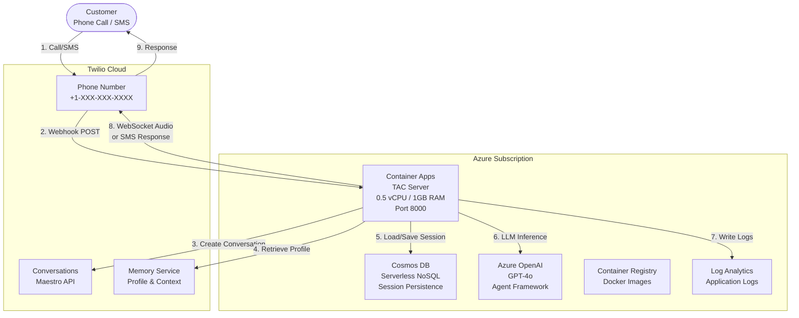

# TAC Agent Framework Server — Azure Container Apps Deployment

Complete guide for deploying Twilio Agent Connect (TAC) with Microsoft Agent Framework on Azure Container Apps.

## Table of Contents

- [Overview](#overview)
- [Architecture](#architecture)
- [Azure Services](#azure-services)
- [Deployment](#deployment)

---

## Overview

This deployment runs a voice and SMS AI agent using:
- **Twilio** — Voice/SMS communication platform
- **Azure OpenAI** — LLM inference (GPT-4o)
- **Microsoft Agent Framework** — Agent orchestration
- **Azure Cosmos DB** — Session persistence for horizontal scaling
- **TAC (Twilio Agent Connect)** — Integration middleware

The system handles incoming calls and SMS messages, routes them through an AI agent powered by Azure OpenAI, and manages conversation state using Cosmos DB and Twilio's Memory services.

---

## Architecture



---

## Azure Services

### Core Services

| Service | Purpose |
|---------|---------|
| **Container Apps** | Container runtime with built-in ingress, TLS, and auto-scaling |
| **Cosmos DB** | Session persistence (serverless NoSQL, pay-per-request) |
| **Azure OpenAI** | LLM inference — GPT-4o (via Agent Framework) |
| **Container Registry** | Docker image storage (Basic SKU) |
| **Log Analytics** | Application logs (30-day retention) |
| **Managed Identity** | Passwordless auth from Container App to Cosmos DB |

---

## Deployment

### Prerequisites

**Required:**
- Azure CLI (`az`) installed and logged in
- Docker installed
- Python 3.10+ with `pip`
- Azure subscription with:
  - Azure OpenAI deployment (GPT-4o recommended)
  - Permission to create Container Apps, Cosmos DB, and Container Registry
- Twilio account with:
  - Auth Token
  - API Key and Secret
  - Phone number
  - Conversation Configuration ID from Conversation Orchestrator

**Where to find Twilio credentials:**
- Auth Token & API Keys: Twilio Console > Account > API Keys & Tokens
- Conversation Configuration ID: Twilio Console > Conversation Orchestrator > Configuration

### Step 0: Build and Push Docker Image

**1. Build wheels:**

```bash
cd deploy/agent_framework_container_apps
./build-wheels.sh
```

**2. Build Docker image:**

```bash
# Run from the deploy/ directory (parent of agent_framework_container_apps)
cd deploy
docker build -t tac-agent-framework:latest -f agent_framework_container_apps/Dockerfile .
```

### Step 1: Deploy Azure Infrastructure

**1. Create a resource group:**

```bash
az group create \
  --name tac-agent-framework-rg \
  --location eastus2
```

**2. Deploy the Bicep template:**

```bash
cd deploy/agent_framework_container_apps

az deployment group create \
  --resource-group tac-agent-framework-rg \
  --template-file infra/main.bicep \
  --parameters \
    environmentName=tacagent \
    twilioTacAuthToken=YOUR_AUTH_TOKEN \
    twilioTacApiKey=YOUR_API_KEY \
    twilioTacApiToken=YOUR_API_TOKEN \
    twilioTacPhoneNumber=YOUR_PHONE_NUMBER \
    twilioTacConversationConfigurationId=YOUR_CONFIGURATION_ID \
    azureAiProjectEndpoint=YOUR_AZURE_AI_ENDPOINT
```

**3. Get the ACR login server from the output:**

```bash
ACR_LOGIN_SERVER=$(az deployment group show \
  --resource-group tac-agent-framework-rg \
  --name main \
  --query 'properties.outputs.acrLoginServer.value' -o tsv)
```

### Step 2: Push Image to ACR

```bash
az acr login --name ${ACR_LOGIN_SERVER%%.*}

docker tag tac-agent-framework:latest $ACR_LOGIN_SERVER/tac-agent-framework:latest
docker push $ACR_LOGIN_SERVER/tac-agent-framework:latest
```

### Step 3: Update Container App with Image

Re-deploy with the actual image name and the Container App FQDN as the voice domain:

```bash
FQDN=$(az deployment group show \
  --resource-group tac-agent-framework-rg \
  --name main \
  --query 'properties.outputs.containerAppFqdn.value' -o tsv)

az deployment group create \
  --resource-group tac-agent-framework-rg \
  --template-file infra/main.bicep \
  --parameters \
    environmentName=tacagent \
    containerImageName=$ACR_LOGIN_SERVER/tac-agent-framework:latest \
    twilioTacVoicePublicDomain=$FQDN \
    twilioTacAuthToken=YOUR_AUTH_TOKEN \
    twilioTacApiKey=YOUR_API_KEY \
    twilioTacApiToken=YOUR_API_TOKEN \
    twilioTacPhoneNumber=YOUR_PHONE_NUMBER \
    twilioTacConversationConfigurationId=YOUR_CONFIGURATION_ID \
    azureAiProjectEndpoint=YOUR_AZURE_AI_ENDPOINT
```

### Step 4: Get Container App URL

```bash
echo "https://$FQDN"
```

Container Apps provides built-in HTTPS with a valid TLS certificate — no ngrok or reverse proxy needed.

### Step 5: Configure Twilio Webhooks

**Voice (Phone Numbers):**
1. Go to Twilio Console > Phone Numbers > Active Numbers
2. Select your phone number
3. Set **Voice URL:** `https://<FQDN>/twiml` (POST)

**SMS (Conversation Orchestrator):**
1. Go to Twilio Console > Conversation Orchestrator
2. Select your Conversation Configuration
3. Set **Webhook URL:** `https://<FQDN>/webhook` (POST)

### Step 6: Test Your Deployment

Make a phone call or send an SMS message to your Twilio phone number to test the deployment.

**View logs:**

```bash
az containerapp logs show \
  --name tacagent-app \
  --resource-group tac-agent-framework-rg \
  --type console \
  --follow
```
