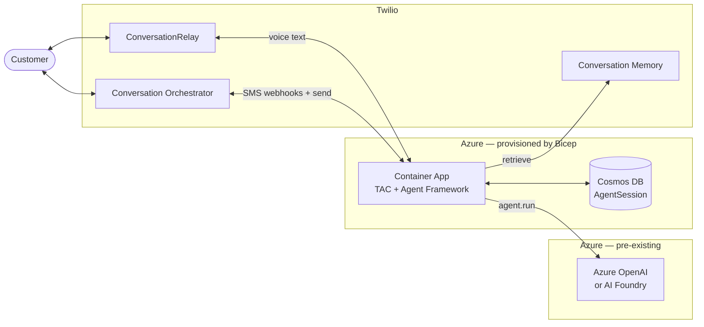

# TAC Agent Framework on Azure Container Apps

Complete guide for deploying Twilio Agent Connect (TAC) with Microsoft Agent Framework on Azure Container Apps.

## Table of Contents

- [Overview](#overview)
- [Architecture](#architecture)
- [Azure Services](#azure-services)
- [Deployment](#deployment)

---

## Overview

This deployment runs a voice and SMS AI agent using:
- **Twilio** — Voice (ConversationRelay) and SMS, plus Conversation Orchestrator and Conversation Memory
- **Azure OpenAI** — LLM inference (e.g. GPT-4o). Azure AI Foundry is also supported by the connector; the Bicep defaults provision against Azure OpenAI.
- **Microsoft Agent Framework** — Agent orchestration (Python library running inside the Container App)
- **Azure Cosmos DB** — `AgentSession` persistence for horizontal scaling (SMS: load/save per message, Voice: background save per utterance)
- **TAC (Twilio Agent Connect)** — Integration middleware

The system handles incoming calls (via TwiML + ConversationRelay WebSocket) and SMS messages (via Conversation Orchestrator webhook), routes them through a Microsoft Agent Framework agent, and persists `AgentSession` state in Cosmos DB. Memory retrieval uses Twilio's Conversation Memory with a fallback to Conversation Orchestrator `list_communications`.

**Note:** The Azure OpenAI (or Azure AI Foundry) account is **not** provisioned by this Bicep — the deployment expects an **existing** account and assigns the container app's managed identity the `Cognitive Services OpenAI User` role on it.

---

## Architecture



**Flow:**
- **Voice:** Twilio Phone receives call → `POST /twiml` → response TwiML contains `<ConversationRelay>` → ConversationRelay handles STT/TTS and opens a WebSocket to `/ws` for bidirectional text.
- **SMS:** Conversation Orchestrator delivers inbound SMS to `POST /webhook` and is used to send outbound replies.
- **Every turn:** TAC optionally retrieves memory (Conversation Memory, with fallback to Conversation Orchestrator `list_communications`), then `agent.run()` against Azure OpenAI.
- **`AgentSession`:** loaded from Cosmos on each SMS message, background-saved on each voice utterance.

---

## Azure Services

### Provisioned by this Bicep

| Service | Purpose |
|---------|---------|
| **Container Apps** | Container runtime with built-in ingress, TLS, and auto-scaling |
| **Cosmos DB** | `AgentSession` persistence (serverless NoSQL, pay-per-request) |
| **Container Registry** | Docker image storage (Basic SKU) |
| **Log Analytics** | Application logs (30-day retention) |
| **Managed Identity (system-assigned)** | Passwordless auth from Container App to Cosmos DB and Azure OpenAI |

### Required pre-existing

| Service | Purpose |
|---------|---------|
| **Azure OpenAI** (or Azure AI Foundry) | LLM inference for the Agent Framework agent. Pass the account name and endpoint as Bicep parameters; the deployment assigns the container app's MI the `Cognitive Services OpenAI User` role on it. |

---

## Prerequisites

- [Azure Developer CLI](https://learn.microsoft.com/en-us/azure/developer/azure-developer-cli/install-azd) (`azd`)
- Azure CLI (`az`) installed and logged in
- Docker installed and running
- Python 3.10+ with `pip`
- Azure subscription with:
  - Azure OpenAI deployment (GPT-4o recommended)
  - Permission to create Container Apps, Cosmos DB, and Container Registry
- Twilio account with:
  - Auth Token
  - API Key and Secret
  - Phone number
  - Conversation Configuration ID from Conversation Orchestrator

**Where to find Twilio credentials:**
- Auth Token & API Keys: Twilio Console > Account > API Keys & Tokens
- Conversation Configuration ID: Twilio Console > Conversation Orchestrator > Configuration

---

## Deployment

### Step 1: Configure Environment

```bash
cd deploy/agent_framework_container_apps
cp .env.template .env
```

Edit `.env` and fill in your Twilio and Azure credentials.

### Step 2: Deploy

```bash
azd env new my-tac-agent
azd env set --file .env
azd up
```

`azd env set --file .env` loads your `.env` into the azd environment so `azd up`
can resolve every Bicep parameter without prompting. Omit it only if you're
happy answering the prompts on first run.

This automatically:
1. Deploys all Azure infrastructure (Container Registry, Cosmos DB, Container App)
2. Builds and pushes the Docker image to ACR (dependencies installed from PyPI)
3. Configures the Container App with the image and FQDN

### Step 3: Configure Twilio Webhooks

After deployment completes, the app URL is printed. Use it to configure Twilio:

**Voice (Phone Numbers):**
1. Go to Twilio Console > Phone Numbers > Active Numbers
2. Select your phone number
3. Set **Voice URL:** `https://<FQDN>/twiml` (POST)

**SMS (Conversation Orchestrator):**
1. Go to Twilio Console > Conversation Orchestrator
2. Select your Conversation Configuration
3. Set **Webhook URL:** `https://<FQDN>/webhook` (POST)

### Step 4: Test

Make a phone call or send an SMS to your Twilio phone number.

**View logs:**

```bash
az containerapp logs show \
  --name <environmentName>-app \
  --resource-group rg-<environmentName> \
  --type console \
  --follow
```

---

## Redeploying After Code Changes

Re-run `azd up` — it will rebuild the Docker image, push it to ACR, and update
the Container App. Infrastructure deployments are idempotent, so unchanged
resources are not re-created.

```bash
azd up
```

---

## Teardown

```bash
azd down --purge
```

---

<details>
<summary><strong>Manual Deployment (without azd)</strong></summary>

### Step 0: Build Docker Image

```bash
# Run from the deploy/ directory (parent of agent_framework_container_apps)
cd deploy
docker build -t tac-agent-framework:latest -f agent_framework_container_apps/Dockerfile .
```

### Step 1: Deploy Azure Infrastructure

**1. Create a resource group:**

```bash
az group create \
  --name tac-agent-framework-rg \
  --location eastus2
```

**2. Deploy the Bicep template:**

```bash
cd deploy/agent_framework_container_apps

az deployment group create \
  --resource-group tac-agent-framework-rg \
  --template-file infra/main.bicep \
  --parameters \
    environmentName=tacagent \
    twilioTacAuthToken=YOUR_AUTH_TOKEN \
    twilioTacApiKey=YOUR_API_KEY \
    twilioTacApiToken=YOUR_API_TOKEN \
    twilioTacPhoneNumber=YOUR_PHONE_NUMBER \
    twilioTacConversationConfigurationId=YOUR_CONFIGURATION_ID \
    azureOpenAiEndpoint=YOUR_AZURE_OPENAI_ENDPOINT
```

**3. Get the ACR login server from the output:**

```bash
ACR_LOGIN_SERVER=$(az deployment group show \
  --resource-group tac-agent-framework-rg \
  --name main \
  --query 'properties.outputs.acrLoginServer.value' -o tsv)
```

### Step 2: Push Image to ACR

```bash
az acr login --name ${ACR_LOGIN_SERVER%%.*}

docker tag tac-agent-framework:latest $ACR_LOGIN_SERVER/tac-agent-framework:latest
docker push $ACR_LOGIN_SERVER/tac-agent-framework:latest
```

### Step 3: Update Container App with Image

Re-deploy with the actual image name and the Container App FQDN as the voice domain:

```bash
FQDN=$(az deployment group show \
  --resource-group tac-agent-framework-rg \
  --name main \
  --query 'properties.outputs.containerAppFqdn.value' -o tsv)

az deployment group create \
  --resource-group tac-agent-framework-rg \
  --template-file infra/main.bicep \
  --parameters \
    environmentName=tacagent \
    containerImageName=$ACR_LOGIN_SERVER/tac-agent-framework:latest \
    twilioTacVoicePublicDomain=$FQDN \
    twilioTacAuthToken=YOUR_AUTH_TOKEN \
    twilioTacApiKey=YOUR_API_KEY \
    twilioTacApiToken=YOUR_API_TOKEN \
    twilioTacPhoneNumber=YOUR_PHONE_NUMBER \
    twilioTacConversationConfigurationId=YOUR_CONFIGURATION_ID \
    azureOpenAiEndpoint=YOUR_AZURE_OPENAI_ENDPOINT
```

### Step 4: Get Container App URL

```bash
echo "https://$FQDN"
```

Container Apps provides built-in HTTPS with a valid TLS certificate — no ngrok or reverse proxy needed.

### Step 5: Configure Twilio Webhooks

See [Step 3](#step-3-configure-twilio-webhooks) above.

### Step 6: Test Your Deployment

See [Step 4](#step-4-test) above.

</details>
