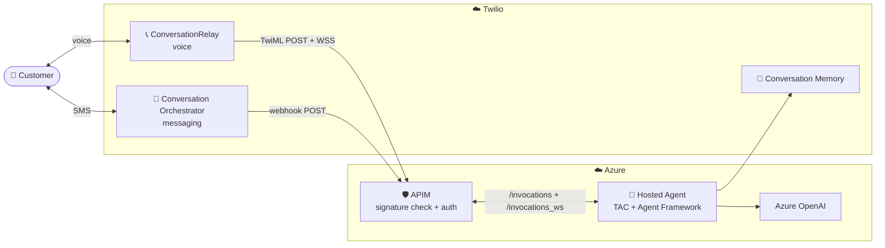

# TAC Hosted Agents (Foundry) Deployment

Deploy Twilio Agent Connect with Microsoft Agent Framework on **Hosted Agents
in Foundry Agent Service**, fronted by APIM for Twilio signature validation and
WebSocket passthrough. One command (`make deploy`) provisions everything fresh.

This is the SMS + voice path; for the Container Apps equivalent see
[`../agent_framework_container_apps`](../agent_framework_container_apps).

## Architecture



## Deployment Components

- **Hosted Agent** — TAC + Agent Framework running in a Foundry sandbox
  (`POST /invocations` + `WS /invocations_ws`).
- **APIM** — validates the Twilio signature, authenticates to Foundry, and
  adapts each Twilio request to the agent's two routes.
- **Created fresh by the deploy** — Foundry account + project + model
  deployment, Container Registry, APIM, and Key Vault.

## Prerequisites

### Required tools

- **[Azure CLI (`az`)](https://learn.microsoft.com/cli/azure/install-azure-cli)**
- **[Azure Developer CLI (`azd`)](https://learn.microsoft.com/azure/developer/azure-developer-cli/install-azd)**
- **`make`, `bash`, `curl`, `python3`** (standard on macOS/Linux)

### Azure account requirements

- **Active subscription** with permission to create Cognitive Services
  (Foundry) accounts, APIM, Key Vault, Container Registry, and role
  assignments.
- **Region:** Hosted Agents is region-limited. Defaults to **`northcentralus`**
  (known-good); override via `AZURE_LOCATION` / `FOUNDRY_LOCATION` only if your
  region supports Hosted Agents.

### Twilio requirements

- Account SID, Auth Token, API Key + Secret, a phone number, and a Conversation
  (Orchestrator) Configuration ID.

### Sign in

```bash
az login
azd auth login
# If azd later reports an expired token / scope error:
azd auth login --scope https://ai.azure.com/.default
```

> **Multi-tenant accounts.** If your subscription lives in a different AAD
> tenant than your default Azure account, run `az login --tenant <tenant-id>`
> **before** `azd auth login`. Otherwise provisioning fails with a confusing
> "Login expired" error even though `azd auth login` succeeded — the Bicep
> provider authenticates through the `az` CLI's default tenant.

> **Tenant policy note.** Some tenants enforce Azure Policy on the created
> resources (required tags, Key Vault firewall, purge protection). The template
> satisfies the common ones (tags every resource; KV firewall + `AzureServices`
> bypass). If a resource is denied, the error names the policy — adjust the
> matching `.env` value or the tags in `infra/`.

---

## Quick Start

### 1. Deploy

From this directory:

```bash
make deploy
```

`make deploy` creates `.env` (from `.env.template`), prompts for any missing
values, derives globally-unique resource names from a single **slug**,
provisions everything fresh, and pushes the agent. It's idempotent — re-run it
anytime.

**Two ways to provide config:**

- **Interactive** — run `make deploy` and answer the prompts (editable
  defaults; secrets hidden).
- **Edit `.env` first** — `cp .env.template .env`, fill it in, then
  `make deploy`. Values already set are used as-is and not prompted (this is
  also the CI path: pre-fill `.env` so nothing prompts).

Required values prompted (if not already in `.env`): your subscription, a
deployment **slug** (first initial + last name, e.g. `jsmith` — names all your
resources), your email, and the Twilio credentials / number / configuration ID.

### 2. Configure Twilio

At the end of the deploy you're asked:

> *Set Conversation Orchestrator webhook URL and Phone number TwiML webhook URL to this deployment now? [y/N]*

Answer **y** to point your number's Voice URL and your CO config's webhook at
this deployment automatically. Re-runnable anytime with `make configure-twilio`.

To set them by hand instead, use the URLs printed at the end (or `make urls`):

- **Phone Number → Voice URL** (**POST**): `twilioVoiceTwimlUrl`
- **Conversation Orchestrator → Webhook** (**POST**): `twilioSmsWebhookUrl`

> ⚠️ **Both must be HTTP POST.** APIM only defines `POST`; a Twilio webhook set
> to GET returns 404 (presents as "no response").

### 3. Test

Text or call your Twilio number.

---

## Make targets

```bash
make deploy            # provision everything + push agent (the main command)
make agent             # rebuild/redeploy just the agent
make urls              # print the Twilio Voice/SMS URLs
make configure-twilio  # point your Twilio number + CO config at this deploy
make down              # tear everything down (prompts, then azd down --force --purge)
```

## View logs

Stream the agent's logs (the session id is the CO `conversationId` for SMS, or
the `CallSid` for voice):

```bash
azd ai agent monitor --session-id <conversationId-or-CallSid>
```

## Update code

- **Edit `agent.py`** → `make deploy` (azd rebuilds + re-pushes the container).
- **Use a newer TAC SDK** → the image installs
  `twilio-agent-connect-microsoft[hosted-agents]` from PyPI (pinned in
  `requirements.txt`). Bump that pin, then `make deploy`.

## Teardown

```bash
make down
```

Deletes the resource group and **purges** the soft-deleted APIM, Foundry
account, and Key Vault so the names are immediately reusable.

---

## Bring-your-own Foundry (advanced)

To deploy against an **existing** Foundry project + ACR instead of creating
fresh ones, set `CREATE_FOUNDRY=false` in `.env` and fill the commented
"BRING-YOUR-OWN" block (`HOSTED_AGENTS_URL`, `AZURE_AI_PROJECT_ID`,
`FOUNDRY_PROJECT_ENDPOINT`, `AZURE_CONTAINER_REGISTRY_ENDPOINT`,
`AZURE_OPENAI_*`). In this mode, grant APIM's identity the `Foundry User` role
yourself (the template only does this when it creates the account):

```bash
az role assignment create \
  --assignee "$(azd env get-value apimPrincipalId)" \
  --role "Foundry User" \
  --scope "<your Foundry account resource id>"
```

To reuse an existing Key Vault, set `EXISTING_KEY_VAULT_NAME` (+
`EXISTING_KEY_VAULT_RESOURCE_GROUP` if in another RG); it must contain a secret
named `TwilioAuthToken`.

---

## How it works

### What APIM does

Hosted Agents only exposes `POST /invocations` and `WS /invocations_ws`, so APIM
adapts every Twilio request to that shape. Per request the policies:

1. **Validate `X-Twilio-Signature`** (HMAC-SHA1, auth token from Key Vault).
   SMS and voice-WS sign the URL only; voice TwiML signs URL + sorted form
   pairs. Mismatch → 401.
2. **Pin a sandbox** by lifting the Twilio ID onto `?agent_session_id=`
   (`data.conversationId` for SMS, `CallSid` for voice), keeping a call's TwiML
   POST and WSS upgrade on one sandbox.
3. **Inject an Entra bearer** via APIM's managed identity — the Foundry
   endpoint isn't public.
4. **Convert form → JSON** (voice TwiML only).
5. **Rewrite to the Foundry route** and strip `X-Twilio-Signature`. The WS
   upgrade additionally requires `agent_session_id` and injects
   `project_name` / `agent_name` / `Foundry-Features`.

### Security

APIM is the only auth boundary in front of the agent: it verifies the Twilio
signature (and strips it after rewriting, so it can't be replayed downstream),
and authenticates to Foundry with a managed identity that holds the
`Foundry User` role. Reaching the agent means compromising APIM's identity, not
just hitting a URL.

---

## Troubleshooting

- **Calls/texts get no response, Twilio shows HTTP 404** — the Twilio webhook
  HTTP method is GET; APIM only defines POST. Set both webhooks to **POST**
  (or run `make configure-twilio`).
- **`/twiml` returns 500 `{"error":"TWILIO_VOICE_PUBLIC_DOMAIN is not set"}`** —
  the agent was pushed without the voice domain. Re-run `make deploy` (it wires
  this after provision).
- **SMS works but voice doesn't, or vice-versa** — `TWILIO_PHONE_NUMBER` and
  `TWILIO_CONVERSATION_CONFIGURATION_ID` point at different orchestrator
  configs. Voice keys off the number, SMS off the config; make them match, then
  `make configure-twilio`.
- **APIM returns 401 "Invalid X-Twilio-Signature"** — signature mismatch.
  Enable the APIM trace (`Ocp-Apim-Trace` header / portal Test tab) to inspect
  the signed URL. Common causes: the agent's public domain doesn't match what
  Twilio dials; stale Key Vault secret.
- **Foundry returns 502 / 504** on `/invocations` — sandbox still warming up;
  retry after a few seconds.
- **First provision fails with `Caller is not authorized ... getSecret`** — the
  transient Key Vault RBAC-propagation race. `make deploy` retries it
  automatically; by hand, wait ~30-60s and re-run `azd provision --no-state`.
- **`RequestDisallowedByPolicy`** — your tenant enforces a policy the resource
  doesn't satisfy. The error names it; adjust the matching `.env` value or the
  tags in `infra/`.
- **Phone numbers show without their leading `+`** — cosmetic; `azd env
  get-values` strips `+` from display but stores/substitutes it correctly.
