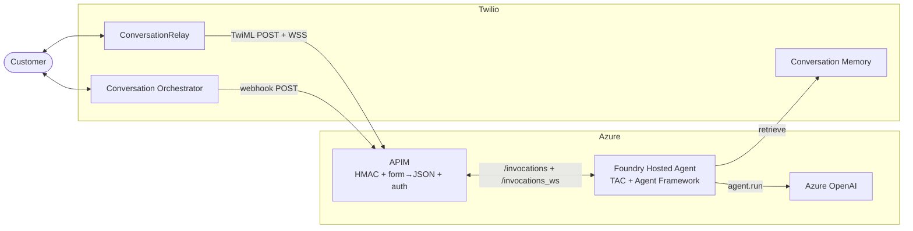

# TAC Agent Framework — Azure Hosted Agents Deployment

Run TAC + Microsoft Agent Framework directly inside Azure AI Foundry's
**Hosted Agents** runtime, with APIM in front for HMAC validation,
form-to-JSON conversion, and sandbox affinity.

This is the SMS + voice path; for the Container Apps equivalent, see
[`../agent_framework_container_apps`](../agent_framework_container_apps).

## When to use this over Container Apps

| | Container Apps | Hosted Agents |
|---|---|---|
| Cost at low volume | Always-on container | Scales to zero per sandbox |
| Cold-start latency | ~1s | Higher on first request |
| Session storage | Cosmos DB recommended | `$HOME/tac_sessions` (sandbox-pinned) |
| Auth surface | Twilio HMAC at the app | Twilio HMAC at APIM |
| WebSocket support | Direct | Bridged via APIM WSS API |

Use Hosted Agents when traffic is bursty enough that paying for an
always-on Container App is wasteful, and when you're already in the
Foundry ecosystem.

## Architecture



**Flow:**
- **SMS:** Twilio CO posts JSON to `https://<apim>/twilio/webhook`.
  APIM validates HMAC, lifts `data.conversationId` onto
  `?agent_session_id=...`, and forwards to `/invocations`. The
  `TACHostedAgentsServer` dispatcher fans the body out to all
  registered messaging channels.
- **Voice:** Twilio posts a form to `https://<apim>/twilio/twiml`. APIM
  converts form → JSON (TAC's HMAC validator runs at the agent layer)
  and forwards to `/invocations`. The server returns TwiML containing
  `<Connect><ConversationRelay url="wss://<apim>/twilio/ws?agent_session_id=<CallSid>"/>`.
- **Voice WS:** Twilio dials the WSS URL. APIM validates HMAC on the
  upgrade, requires `agent_session_id` on the query, injects the
  Foundry auth + feature flag, and rewrites to `/invocations_ws`.

## Prerequisites

- Azure subscription with permission to create APIM, Key Vault, and
  role assignments
- Azure CLI (`az`) and Azure Developer CLI (`azd`) installed and signed in
- An Azure OpenAI deployment (Bicep here does **not** create one)
- An existing Foundry account + project (created out of band — `azd`
  for Hosted Agents expects the project to already exist; this template
  does not create it)
- Twilio account with: Auth Token, API Key + Secret, phone number,
  and a Conversation Configuration ID

The Bicep template provisions a Key Vault for the Twilio Auth Token by
default. If you'd rather reuse an existing vault, set
`EXISTING_KEY_VAULT_NAME` (and optionally `EXISTING_KEY_VAULT_RESOURCE_GROUP`
if it lives in a different RG) — the vault must already contain a
secret named `TwilioAuthToken`.

## Deploy

`azd up` does both the APIM/Key Vault Bicep and the Foundry agent push
in one shot — `infra/main.bicep` runs first, then the agent container
is built and registered with the Foundry project.

### 1. Configure environment + build the SDK wheel

```bash
cd deploy/agent_framework_hosted_agents
cp .env.template .env
# fill in .env with your values — see "Required env vars" below

# The Dockerfile installs the SDK from a vendored wheel under wheels/
# (because TACHostedAgentsServer isn't on PyPI yet). Build it from the
# repo root:
( cd ../.. && uv build && \
  cp dist/twilio_agent_connect_microsoft-*-py3-none-any.whl \
     deploy/agent_framework_hosted_agents/wheels/ )
```

Once the SDK is published to PyPI with `TACHostedAgentsServer`, this
wheel can be removed and `requirements.txt` can install the package
from PyPI directly.

#### Required env vars (the non-obvious ones)

These four are the most common failure points if missed:

- **`HOSTED_AGENTS_URL`** must end at `/endpoint/protocols`, NOT the
  account root. The SMS policy rewrites incoming requests to
  `<HOSTED_AGENTS_URL>/invocations`, so the value here has to be the
  agent path:
  ```
  https://<account>.services.ai.azure.com/api/projects/<project>/agents/<agent>/endpoint/protocols
  ```
  Setting it to just the account root will produce 404s on every SMS
  webhook.

- **`AZURE_AI_PROJECT_ID`** — full resource ID of the Foundry project,
  e.g.
  `/subscriptions/<sub>/resourceGroups/<rg>/providers/Microsoft.CognitiveServices/accounts/<account>/projects/<project>`.
  azd needs this to know where to register the agent.

- **`FOUNDRY_PROJECT_ENDPOINT`** — the project's REST endpoint, e.g.
  `https://<account>.services.ai.azure.com/api/projects/<project>`.

- **`AZURE_CONTAINER_REGISTRY_ENDPOINT`** — the ACR the Foundry account
  uses for agent images, e.g. `<account>acr.azurecr.io`.

These last three aren't auto-discovered by `azd` for `host:
azure.ai.agent`; without them, `azd deploy` fails partway through.

### 2. Run `azd up`

```bash
azd env new my-tac-agent --location eastus2 --subscription <sub-id>
azd env set AZURE_RESOURCE_GROUP <rg>

# IMPORTANT: load .env into the azd environment BEFORE running azd up.
# `azd up` validates Bicep parameters before invoking the preprovision
# hook, so leaving this to the hook causes "missing required inputs"
# errors on the first run.
azd env set --file .env

azd up
```

This:

1. Provisions APIM + Key Vault + APIs/policies via `infra/main.bicep`.
2. Builds the agent container and registers it with the Foundry project.

**Heads up:** the first `azd up` against a fresh Key Vault commonly
fails partway through with `Caller is not authorized to perform action
on resource ... getSecret/action` — APIM tries to read the seeded
secret before its `Key Vault Secrets User` role assignment has
propagated through Azure's RBAC layer. Wait ~30 seconds and re-run
`azd provision --no-state`; the second attempt always succeeds.

### 3. Grant APIM access to Foundry

Bicep can't grant roles on the Foundry account (it commonly lives
outside the subscription/RG that owns this deployment). Do this once
manually:

```bash
APIM_PRINCIPAL_ID=$(azd env get-values | grep apimPrincipalId | cut -d'"' -f2)
FOUNDRY_ACCOUNT_RESOURCE_ID=<from your Foundry portal>

az role assignment create \
  --assignee "$APIM_PRINCIPAL_ID" \
  --role "Foundry User" \
  --scope "$FOUNDRY_ACCOUNT_RESOURCE_ID"
```

(The role is named `Foundry User`, not `Azure AI User` — the latter
doesn't exist as a built-in role. This grants APIM the right to
forward requests to agents under that account.)

### 4. Configure Twilio

The Bicep outputs three URLs (see `azd env get-values | grep -i twilio`):

- **Phone Number → Voice URL:** the value of `twilioVoiceTwimlUrl`
  (POST)
- **Conversation Orchestrator → Webhook URL:** the value of
  `twilioSmsWebhookUrl` (POST)

After APIM is up, set `TWILIO_VOICE_PUBLIC_DOMAIN` in `.env` to the
value of `voicePublicDomain` and re-run `azd up` so the agent can
build the correct TwiML WSS URL.

### 5. Test

Make a call or send an SMS to your Twilio number. Watch logs:

```bash
az ai agent logs --agent <agent-name> --project <project-name> --follow
```

## Teardown

```bash
azd down --purge                              # Foundry agent
az group delete --name <rg> --yes --no-wait   # APIM resource group
```

## Troubleshooting

- **APIM returns 401 with `X-Debug-*` headers** — HMAC mismatch. The
  debug headers show the URL APIM signed and the signature it computed.
  Common causes: `public_domain` env on the agent doesn't match what
  Twilio is dialing; secret in Key Vault is stale; APIM's MI doesn't
  have `Key Vault Secrets User` on the vault.
- **APIM returns 400 "Missing agent_session_id"** on a WSS upgrade —
  the agent emitted a TwiML wss URL without the query param. Confirm
  the agent log shows `?agent_session_id=...` in the generated TwiML.
- **APIM returns 200 but Foundry returns 404** — `HOSTED_AGENTS_URL`
  is set to the account root instead of the agent's
  `/endpoint/protocols` path. See "Required env vars" above. Fix the
  `.env`, run `azd provision --no-state` (without `--no-state`, azd
  caches the previous parameters and skips the redeploy).
- **Foundry returns 502 / 504** on `/invocations` — sandbox hasn't
  finished its readiness probe. Try again after a few seconds; if
  persistent, check that `azd up` completed without errors.
- **Voice connects but agent says nothing** — the wss URL APIM rewrote
  isn't reaching `/invocations_ws`. Check the WS API's `serviceUrl` and
  `rewrite-uri` template in the policy.
- **Bicep error `RoleAssignmentExists`** — the APIM-MI → KV role is
  already granted (e.g. from a prior deploy or manual `az role
  assignment create`). Set `SKIP_KEY_VAULT_ROLE_ASSIGNMENT=true` in
  `.env` and redeploy. Azure rejects duplicate `(principal, role,
  scope)` triples even with different role-assignment GUIDs, so this
  is the only reliable way to make Bicep idempotent across deploy
  modes.
- **`azd deploy` fails with `AZURE_AI_PROJECT_ID is not set`** /
  `FOUNDRY_PROJECT_ENDPOINT is required` /
  `could not determine container registry endpoint` — these are the
  three azd-required envs Hosted Agents doesn't auto-discover. See
  "Required env vars" above and add them to `.env`.
- **`azd provision` reports "no changes" after editing `.env`** — azd
  caches the deployment plan. Force a rerun with
  `azd provision --no-state`.
- **Phone numbers in the agent env appear without their leading `+`**
  — `azd env get-values` strips `+` characters in display output, but
  the underlying `.azure/<env>/.env` file stores them correctly and
  azd substitutes them faithfully into `agent.yaml`. This is cosmetic.
- **`azd up --no-prompt` errors with "N required inputs are missing"
  on first run** — `azd up` validates Bicep parameters before the
  preprovision hook gets a chance to import `.env`. Run
  `azd env set --file .env` BEFORE `azd up`, as documented above.
- **Bicep error `enablePurgeProtection cannot be set to false`** —
  your tenant requires purge protection on Key Vaults. Leave
  `KEY_VAULT_PURGE_PROTECTION=true` in `.env` (the default).
- **`Caller is not authorized to perform action ... getSecret/action`
  during the first provision** — APIM tried to read the secret before
  the `Key Vault Secrets User` role assignment finished propagating.
  Re-run `azd provision --no-state`; the second attempt succeeds. Most
  Azure samples accept this as a known propagation issue.
- **`az role assignment create ... ERROR: Role 'Azure AI User' doesn't
  exist`** — the correct role name is `Foundry User` (the previous
  README had the wrong name). See step 3 above.
