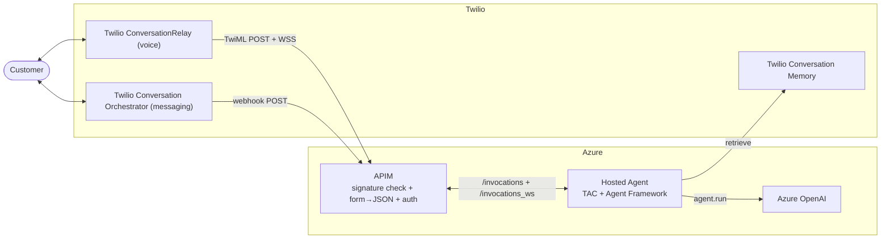

# TAC Agent Framework on Hosted Agents in Foundry Agent Service

Run TAC + Microsoft Agent Framework directly inside **Hosted Agents in
Foundry Agent Service**, with APIM in front for Twilio request signature
validation, websocket passthrough, and per-conversation sandbox
affinity.

This is the SMS + voice path; for the Container Apps equivalent, see
[`../agent_framework_container_apps`](../agent_framework_container_apps).

## Architecture



**Flow:**
- **SMS:** Twilio CO posts JSON to `https://<apim>/twilio/webhook`.
  APIM verifies the Twilio signature, lifts `data.conversationId` onto
  `?agent_session_id=...`, and forwards to `/invocations`. The
  `TACHostedAgentsApp` dispatcher fans the body out to all
  registered messaging channels.
- **Voice:** Twilio posts a form to `https://<apim>/twilio/twiml`. APIM
  verifies the signature, converts form → JSON, and forwards to
  `/invocations`. The server returns TwiML containing
  `<Connect><ConversationRelay url="wss://<apim>/twilio/ws?agent_session_id=<CallSid>"/>`.
- **Voice WS:** Twilio dials the WSS URL. APIM verifies the signature on
  the upgrade, requires `agent_session_id` on the query, injects the
  Foundry auth + feature flag, and rewrites to `/invocations_ws`.

## What APIM does

Hosted Agents only exposes `POST /invocations` and `WS /invocations_ws`,
so APIM sits in front and adapts every Twilio request to that shape. Per
request, the policies:

1. **Validate `X-Twilio-Signature`** (HMAC-SHA1, auth token from Key
   Vault). SMS and voice-WS sign the URL only; voice TwiML signs URL +
   sorted form pairs. Mismatch → 401.
2. **Pin a sandbox** by lifting the Twilio ID onto
   `?agent_session_id=` — `data.conversationId` for SMS,
   `CallSid` for voice. Keeps a call's TwiML POST and WSS upgrade (and
   any retries) on one sandbox.
3. **Inject an Entra bearer** via APIM's managed identity
   (`resource=https://ai.azure.com`) — the Foundry endpoint isn't
   public.
4. **Convert form → JSON** (voice TwiML only; `set-body`). SMS is
   already JSON; the WS upgrade has no body.
5. **Rewrite to the Foundry route** (`/invocations` or
   `/invocations_ws`) and strip `X-Twilio-Signature` (no longer valid
   after the rewrite). The WS upgrade also requires `agent_session_id`
   on the query and injects `project_name` / `agent_name` /
   `Foundry-Features`.

## Security

APIM is the only authentication boundary in front of your agent, and it
does two things:

1. **Verifies the Twilio request signature** (the `X-Twilio-Signature`
   header) so only requests Twilio actually sent reach the agent. The
   agent layer does not re-check it — APIM strips the header after
   rewriting the URL and (for voice) the body, so the signature can no
   longer be reproduced downstream.
2. **Authenticates to the Hosted Agent.** The Foundry endpoint is not
   public; it requires an Entra bearer token, and only APIM's managed
   identity holds the `Foundry User` role. So reaching the agent means
   compromising APIM's identity, not just hitting a URL.

If you ever expose the Foundry endpoint publicly or with a shared key,
you'd need to move signature validation into `TACHostedAgentsApp`
itself — which means having APIM forward the original signed URL and
body so the signature stays reproducible.

## Prerequisites

- **Azure subscription** with permission to create Cognitive Services
  (Foundry) accounts, APIM, Key Vault, Container Registry, and role
  assignments. By default the deploy creates **all** of these fresh — you
  do not need an existing Foundry account, project, model, or registry.
- **Azure CLI (`az`)** and **Azure Developer CLI (`azd`)**, both installed
  and signed in:
  ```bash
  az login
  azd auth login
  ```
  If `azd` later reports an expired token or a scope error, re-auth with the
  Foundry scope explicitly:
  ```bash
  azd auth login --scope https://ai.azure.com/.default
  ```
- **Region support.** Hosted Agents in Foundry Agent Service is only
  available in certain regions. The deploy defaults to **`northcentralus`**
  (a known-good region). Override with `AZURE_LOCATION` / `FOUNDRY_LOCATION`
  in `.env` only if you know your target region supports Hosted Agents.
- **Twilio account** with: Account SID, Auth Token, API Key + Secret, a
  phone number, and a Conversation (Orchestrator) Configuration ID.
- **`make`, `bash`, `curl`, `python3`** locally (standard on macOS/Linux).
- **`uv`** if you are modifying the SDK and need to rebuild the vendored
  wheel (see "Deploying code changes").

> **Tenant policy note.** Some tenants enforce Azure Policy on the resources
> this template creates — e.g. requiring a `created_by` tag, Key Vault
> firewall, or Key Vault purge protection. The template is written to satisfy
> the common ones (it tags all resources and creates the Key Vault with a
> firewall + `AzureServices` bypass). If your tenant denies a resource,
> the error names the policy; adjust the corresponding `.env` value or tags
> in `infra/`.

## Deploy

The entire stack deploys with **one command**. From this directory:

```bash
make deploy
```

**Two ways to provide configuration — pick whichever you prefer:**

- **Interactively** — just run `make deploy`. It creates `.env` for you and
  prompts for each required value (with editable defaults; secrets hidden).
- **Edit `.env` first** — `cp .env.template .env`, fill in the values, then run
  `make deploy`. Anything already set in `.env` is used as-is and *not*
  prompted for; only missing required values are prompted. (This is also how
  you'd run it in a script/CI: pre-fill `.env` so nothing prompts.)

Either way, `make deploy` (which runs `./deploy.sh`):

1. **Creates `.env`** from `.env.template` if it doesn't exist.
2. **Prompts** for any required values not already in `.env` (subscription, a
   deployment *slug*, your email, and the Twilio credentials/number/config —
   secrets are entered hidden). Defaults are pre-filled and editable. If you
   pre-filled `.env`, this is silent.
3. **Derives globally-unique resource names** from the slug + a stable hash,
   so every engineer gets an independent, collision-free deployment and
   re-running updates the *same* stack. (The slug is consumed after first use;
   the literal names are then written into `.env` as the source of truth.)
4. **Confirms** before starting, then **provisions everything fresh** —
   Foundry account + project + model deployment + Container Registry + APIM +
   Key Vault + policies + the APIM→Foundry role grant — retrying once
   automatically on the transient Key Vault RBAC-propagation race.
5. **Pushes the agent** and wires its environment (project endpoint, ACR,
   Azure OpenAI endpoint/key, and `TWILIO_VOICE_PUBLIC_DOMAIN`) from the
   provision outputs.
6. **Offers to configure Twilio for you** (see below).

Everything is read from / written to `.env` — you don't run raw `azd`
commands. To re-run, just `make deploy` again; it's idempotent.

### Configure Twilio

At the end of a successful deploy, you're prompted:

> *Set Conversation Orchestrator webhook URL and Phone number TwiML webhook URL to this deployment now? [y/N]*

Answer **y** and the deploy points your Twilio number's **Voice URL** and your
Conversation Orchestrator config's **webhook** at this deployment (both as
HTTP **POST**). You can also run it later, anytime:

```bash
make configure-twilio
```

If you'd rather set them by hand, the URLs are printed at the end of the
deploy (and via `make urls`):

- **Phone Number → Voice URL** (**POST**): `twilioVoiceTwimlUrl`
- **Conversation Orchestrator → Webhook** (**POST**): `twilioSmsWebhookUrl`

> ⚠️ **Both must use HTTP POST.** Twilio's number config can default the Voice
> URL method to GET — the APIM gateway only defines `POST` and returns **404**
> for a GET, which presents as "no response" on calls.

### Test

Call or text your Twilio number. To watch the agent's logs live:

```bash
azd ai agent monitor --session-id <conversationId-or-CallSid>
```

(The SMS session id is the Conversation Orchestrator `conversationId`; the
voice session id is the `CallSid`.)

### Other make targets

```bash
make agent             # rebuild/redeploy just the agent (azd deploy)
make urls              # print the Twilio Voice/SMS URLs
make configure-twilio  # point Twilio at this deployment
make down              # tear everything down (azd down --purge)
```

### Bring-your-own Foundry (advanced)

To deploy against an **existing** Foundry project + ACR instead of creating
fresh ones, set `CREATE_FOUNDRY=false` in `.env` and supply `HOSTED_AGENTS_URL`,
`AZURE_AI_PROJECT_ID`, `FOUNDRY_PROJECT_ENDPOINT`,
`AZURE_CONTAINER_REGISTRY_ENDPOINT`, and the `AZURE_OPENAI_*` values (the
commented "BRING-YOUR-OWN" block in `.env.template`). In this mode you must
also grant APIM's managed identity the **`Foundry User`** role on the account
yourself (the template only does this automatically when it creates the
account):

```bash
az role assignment create \
  --assignee "$(azd env get-value apimPrincipalId)" \
  --role "Foundry User" \
  --scope "<your Foundry account resource id>"
```

To reuse an existing Key Vault for the Twilio Auth Token, set
`EXISTING_KEY_VAULT_NAME` (+ `EXISTING_KEY_VAULT_RESOURCE_GROUP` if it's in
another RG); the vault must already contain a secret named `TwilioAuthToken`.

## Deploying code changes

- **Editing `agent.py`** (this deployment's agent logic) — just `make deploy`
  again; `azd` rebuilds and re-pushes the container.
- **Editing the TAC SDK** (`src/tac_microsoft/...`) — the Dockerfile installs
  the SDK from a **vendored wheel** under `wheels/` (because
  `TACHostedAgentsApp` isn't on PyPI yet), so you must rebuild it first:
  ```bash
  ( cd ../.. && uv build && \
    rm -f deploy/agent_framework_hosted_agents/wheels/*.whl && \
    cp dist/twilio_agent_connect_microsoft-*-py3-none-any.whl \
       deploy/agent_framework_hosted_agents/wheels/ )
  make deploy
  ```
  Once the SDK is published to PyPI with `TACHostedAgentsApp`, the wheel can be
  removed and `requirements.txt` can install from PyPI directly.

## Teardown

```bash
make down    # azd down --purge — deletes the RG and purges APIM + Foundry
```

This removes the resource group and **purges** the soft-deleted APIM and
Foundry account so their globally-unique names are free to reuse.

## Troubleshooting

- **APIM returns 401 "Invalid X-Twilio-Signature"** — signature
  mismatch. To see the URL APIM signed and the HMAC it computed, enable
  the APIM trace console (`Ocp-Apim-Trace` header, or the portal Test
  tab) and inspect the `twilioFullUrl` / `twilioComputedSig` variables —
  the policy deliberately does not echo these on the wire.
  Common causes: `public_domain` env on the agent doesn't match what
  Twilio is dialing; secret in Key Vault is stale; APIM's MI doesn't
  have `Key Vault Secrets User` on the vault.
- **APIM returns 400 "Missing agent_session_id"** on a WSS upgrade —
  the agent emitted a TwiML wss URL without the query param. Confirm
  the agent log shows `?agent_session_id=...` in the generated TwiML.
- **`/twiml` returns 500 `{"error":"TWILIO_VOICE_PUBLIC_DOMAIN is not set"}`**
  — the agent was pushed without the voice public domain. `make deploy`
  wires this automatically after provision; if you ran a bare `azd deploy`,
  re-run `make deploy` so it bridges the value, or set it manually:
  `azd env set TWILIO_VOICE_PUBLIC_DOMAIN "$(azd env get-value voicePublicDomain)"`
  then `make agent`.
- **Calls/texts get no response, and Twilio shows HTTP 404** — the Twilio
  webhook is configured with the wrong **HTTP method**. The APIM gateway only
  defines `POST`; a GET 404s. Set the Voice URL and the CO webhook method to
  **POST** (or just run `make configure-twilio`, which sets both correctly).
- **SMS gets no reply but voice works (or vice-versa)** — the
  `TWILIO_PHONE_NUMBER` and `TWILIO_CONVERSATION_CONFIGURATION_ID` in `.env`
  point at *different* orchestrator configs. Voice keys off the number; SMS
  keys off the config. Make sure the config ID is the one bound to that phone
  number, then `make configure-twilio`.
- **Foundry returns 502 / 504** on `/invocations` — sandbox hasn't
  finished its readiness probe. Try again after a few seconds; if
  persistent, check that the deploy completed without errors.
- **Voice connects but agent says nothing** — the wss URL APIM rewrote
  isn't reaching `/invocations_ws`. Check the WS API's `serviceUrl` and
  `rewrite-uri` template in the policy.
- **First provision fails with `Caller is not authorized ... getSecret`** —
  the transient Key Vault RBAC-propagation race. `make deploy` retries this
  automatically; if you're running `azd` by hand, wait ~30-60s and re-run
  `azd provision --no-state`.
- **Resource policy denial (`RequestDisallowedByPolicy`)** — your tenant
  enforces a policy the resource doesn't satisfy (a required tag, Key Vault
  firewall, purge protection, etc.). The error names the policy. Common ones
  are already handled (tags on every resource, KV firewall + purge protection
  default `true`); adjust the matching `.env` value or `infra/` tags otherwise.
- **`azd provision` reports "no changes" after editing `.env`** — `make
  deploy` already uses `--no-state` to force a re-evaluation; if running `azd`
  directly, add `--no-state`.
- **Phone numbers in the agent env appear without their leading `+`** —
  cosmetic: `azd env get-values` strips `+` from display output, but the
  underlying `.azure/<env>/.env` stores and substitutes them correctly.
