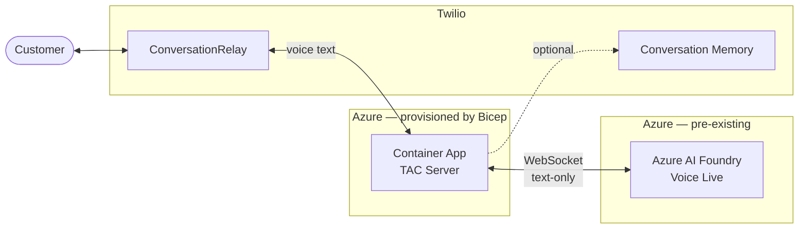

# TAC Voice Live Server — Azure Container Apps Deployment

Complete guide for deploying Twilio Agent Connect (TAC) with Azure AI Foundry Voice Live on Azure Container Apps.

## Table of Contents

- [Overview](#overview)
- [Architecture](#architecture)
- [Azure Services](#azure-services)
- [Deployment](#deployment)

---

## Overview

This deployment runs a voice-only AI agent using:
- **Twilio** — Voice via ConversationRelay (STT/TTS), plus optional Conversation Memory / Conversation Orchestrator
- **Azure AI Foundry Voice Live** — Low-latency LLM inference via WebSocket (pre-existing; not provisioned by this Bicep)
- **TAC (Twilio Agent Connect)** — Integration middleware

Voice Live manages conversation state server-side. The TAC server acts as a bridge between Twilio's ConversationRelay and Voice Live's WebSocket API, operating in text-only mode (`modalities: ["text"]`) because ConversationRelay handles STT/TTS.

Memory retrieval is **opt-in** — the sample `voice_live/basic.py` does not enable it. Set `VoiceChannelConfig(memory_mode="always")` to have TAC pull from the Conversation Memory (with fallback to Conversation Orchestrator) before each utterance.

---

## Architecture



**Flow:**
- Twilio Phone receives call → `POST /twiml` → response TwiML contains `<ConversationRelay>` → ConversationRelay handles STT/TTS and opens a WebSocket to `/ws` for bidirectional text.
- TAC opens a Voice Live WebSocket (text-only mode) per call; Voice Live manages conversation state server-side.
- Memory retrieval is **opt-in** (`VoiceChannelConfig(memory_mode="always")`); disabled in the sample.

---

## Azure Services

### Provisioned by this Bicep

| Service | Purpose |
|---------|---------|
| **Container Apps** | Container runtime with built-in ingress, TLS, and auto-scaling |
| **Container Registry** | Docker image storage (Basic SKU) |
| **Log Analytics** | Application logs (30-day retention) |

### Required pre-existing

| Service | Purpose |
|---------|---------|
| **Azure AI Foundry** with Voice Live enabled | Low-latency LLM inference via WebSocket. Pass the endpoint and API key as Bicep parameters. |

---

## Prerequisites

- [Azure Developer CLI](https://learn.microsoft.com/en-us/azure/developer/azure-developer-cli/install-azd) (`azd`)
- Azure CLI (`az`) installed and logged in
- Docker installed and running
- Python 3.10+ with `pip`
- Azure subscription with:
  - Azure AI Foundry resource with Voice Live enabled
  - Permission to create Container Apps and Container Registry
- Twilio account with:
  - Auth Token
  - API Key and Secret
  - Phone number
  - Conversation Configuration ID from Conversation Orchestrator

---

## Deployment

### Step 1: Configure Environment

```bash
cd deploy/voice_live_container_apps
cp .env.template .env
```

Edit `.env` and fill in your Twilio and Azure credentials.

### Step 2: Deploy

```bash
azd env new my-tac-voice-live
azd env set --file .env
azd up
```

`azd env set --file .env` loads your `.env` into the azd environment so `azd up`
can resolve every Bicep parameter without prompting. Omit it only if you're
happy answering the prompts on first run.

This automatically:
1. Builds a Python wheel for `twilio-agent-connect-microsoft` from GitHub
3. Deploys all Azure infrastructure (Container Registry, Container App)
4. Builds and pushes the Docker image to ACR
5. Configures the Container App with the image and FQDN

### Step 3: Configure Twilio Webhooks

After deployment completes, the app URL is printed. Use it to configure Twilio:

**Voice (Phone Numbers):**
1. Go to Twilio Console > Phone Numbers > Active Numbers
2. Select your phone number
3. Set **Voice URL:** `https://<FQDN>/twiml` (POST)

### Step 4: Test

Make a phone call to your Twilio phone number.

**View logs:**

```bash
az containerapp logs show \
  --name <environmentName>-app \
  --resource-group rg-<environmentName> \
  --type console \
  --follow
```

---

## Redeploying After Code Changes

Re-run `azd up` — it will rebuild the Docker image, push it to ACR, and update
the Container App. Infrastructure deployments are idempotent, so unchanged
resources are not re-created.

```bash
azd up
```

---

## Teardown

```bash
azd down --purge
```

---

<details>
<summary><strong>Manual Deployment (without azd)</strong></summary>

### Step 0: Build Docker Image

**1. Build wheels:**

```bash
cd deploy/voice_live_container_apps
./build-wheels.sh
```

**2. Build Docker image:**

```bash
# Run from the deploy/ directory (parent of voice_live_container_apps)
cd deploy
docker build -t tac-voice-live:latest -f voice_live_container_apps/Dockerfile .
```

### Step 1: Deploy Azure Infrastructure

**1. Create a resource group:**

```bash
az group create \
  --name tac-voice-live-rg \
  --location eastus2
```

**2. Deploy the Bicep template:**

```bash
cd deploy/voice_live_container_apps

az deployment group create \
  --resource-group tac-voice-live-rg \
  --template-file infra/main.bicep \
  --parameters \
    environmentName=tacvoicelive \
    twilioTacAuthToken=YOUR_AUTH_TOKEN \
    twilioTacApiKey=YOUR_API_KEY \
    twilioTacApiToken=YOUR_API_TOKEN \
    twilioTacPhoneNumber=YOUR_PHONE_NUMBER \
    twilioTacConversationConfigurationId=YOUR_CONFIGURATION_ID \
    azureVoiceLiveEndpoint=YOUR_VOICE_LIVE_ENDPOINT \
    azureVoiceLiveApiKey=YOUR_VOICE_LIVE_API_KEY
```

**3. Get the ACR login server from the output:**

```bash
ACR_LOGIN_SERVER=$(az deployment group show \
  --resource-group tac-voice-live-rg \
  --name main \
  --query 'properties.outputs.acrLoginServer.value' -o tsv)
```

### Step 2: Push Image to ACR

```bash
az acr login --name ${ACR_LOGIN_SERVER%%.*}

docker tag tac-voice-live:latest $ACR_LOGIN_SERVER/tac-voice-live:latest
docker push $ACR_LOGIN_SERVER/tac-voice-live:latest
```

### Step 3: Update Container App with Image

Re-deploy with the actual image name and the Container App FQDN as the voice domain:

```bash
FQDN=$(az deployment group show \
  --resource-group tac-voice-live-rg \
  --name main \
  --query 'properties.outputs.containerAppFqdn.value' -o tsv)

az deployment group create \
  --resource-group tac-voice-live-rg \
  --template-file infra/main.bicep \
  --parameters \
    environmentName=tacvoicelive \
    containerImageName=$ACR_LOGIN_SERVER/tac-voice-live:latest \
    twilioTacVoicePublicDomain=$FQDN \
    twilioTacAuthToken=YOUR_AUTH_TOKEN \
    twilioTacApiKey=YOUR_API_KEY \
    twilioTacApiToken=YOUR_API_TOKEN \
    twilioTacPhoneNumber=YOUR_PHONE_NUMBER \
    twilioTacConversationConfigurationId=YOUR_CONFIGURATION_ID \
    azureVoiceLiveEndpoint=YOUR_VOICE_LIVE_ENDPOINT \
    azureVoiceLiveApiKey=YOUR_VOICE_LIVE_API_KEY
```

### Step 4: Get Container App URL

```bash
echo "https://$FQDN"
```

Container Apps provides built-in HTTPS with a valid TLS certificate — no ngrok or reverse proxy needed.

### Step 5: Configure Twilio Webhooks

See [Step 3](#step-3-configure-twilio-webhooks) above.

### Step 6: Test Your Deployment

See [Step 4](#step-4-test) above.

</details>
